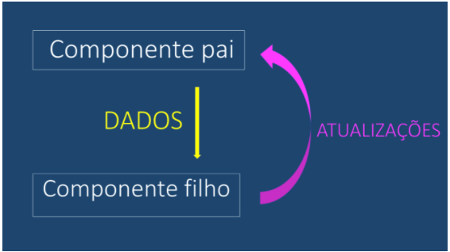

# Two Way Data Binding #

A atualização do dados no react ocorre sempre de pai para filho: 




Sendo assim o responsável sempre pela atualização dos dados será o componente pai ex:

```html
<FlightPlanner>
  <DatePicker />
  <DestinationPicker />
</FlightPlanner>
```

Seguindo o exemplo acima o componente responsável pela atualização dos dados será sempre o:
* FlightPlanner

```html
<FlightPlanner>

  <LocationPicker>
    <OriginPicker />
    <DestinationPicker />
  </LocationPicker>

  <DatePicker />

</FlightPlanner>
```

Já no exemplo acima existem dois componentes responsáveis pela atualização dos dados: 

* FlightPlanner
* LocationPicker


# Como funciona os templates no React #

Para escrever o "html" o react utiliza o React DOM, seria objetos Javascript que irá escrever no dom o html 

ex: 

```javascript
import { React } from 'react'
import { ReactDOM } from 'react-dom'

const element = React.createElement('div', { className: 'welcome-message' }, 'Hello World');


ReactDom.render(
  element,
  document.getElementById('root')
)
```

no final o código acima teremos: 

```html
<div class="welcome-message">Hello World</div>
```

Podemos aninhar elementos também ex: 

```javascript
import { React } from 'react'
import { ReactDOM } from 'react-dom'

const people = [
  {name: 'Michel'},
  {name: 'Ryan'},
  {name: 'Tyler'}
];

const element = React.createElement('ol', null,
  people.map((person, index) => (
    React.createElement('li', {key: index}, person.name)
  ))
);


ReactDom.render(
  element,
  document.getElementById('root')
)
```

## Resultado: ##

```html
  <ol>
    <li id="0">Michel</li>
    <li id="1">Ryan</li>
    <li id="2">Tyler</li>
  </ol>
```

Porem para ajudar nossa vida foi criado o JSX

# JSX #

Esse cara nada mais é que a possibilidade de você escrever o seu template como se fosse um html ex:


refazendo o ultimo exemplo só que agora utilizando jsx: 

```javascript
import { React } from 'react'
import { ReactDOM } from 'react-dom'

const people = [
  {name: 'Michel'},
  {name: 'Ryan'},
  {name: 'Tyler'}
];

const element = <ol>
  {people.map(person => (
    <li key='{person.name}'>{person.name}</li>
  ))}
  <li></li>
</ol>;


ReactDom.render(
  element,
  document.getElementById('root')
)
```

***Muito mais simples né***


# Criando components #

Para criar um componente você pode cria-lo usando classes ou componente funcional sem estado.

Ex: Classe

```javascript
import React, {Component} from 'react';


class ListContacts extends Component {
    render() {
        console.log('props',this.props);
        return (
            <ol className='contact-list'>
                {this.props.contacts.map((contact) => (
                    <li key={contact.id} className='contact-list-item'>
                        <div className='contact-avatar' style={{
                            backgroundImage: `url(${contact.avatarURL})`
                        }}>
                        </div>
                        <div className='contact-details'>
                            <p>{contact.name}</p>
                            <p>{contact.email}</p>
                        </div>
                        <button className='contact-remove'>
                            remove
                        </button>
                    </li>
                ))}
            </ol>
        )
    }
}

export default ListContacts;
```

Ex: Componente funcional sem estado

```javascript
import React, {Component} from 'react';


function ListContactsSemEstado(props) {
    return (
        <ol className='contact-list'>
            {props.contacts.map((contact) => (
                <li key={contact.id} className='contact-list-item'>
                    <div className='contact-avatar' style={{
                        backgroundImage: `url(${contact.avatarURL})`
                    }}>
                    </div>
                    <div className='contact-details'>
                        <p>{contact.name}</p>
                        <p>{contact.email}</p>
                    </div>
                    <button className='contact-remove'>
                        remove
                    </button>
                </li>
            ))}
        </ol>
    )
}

export default ListContactsSemEstado;
```

Ambos são utilizados da mesma forma: 

```javascript
import React, {Component} from "react";
import ListContacts from './ListContacts';
import ListContactsSemEstado from './ListContactsSemEstado';

const contacts = [
    {
        "id": "ryan",
        "name": "Ryan Florence",
        "email": "ryan@reacttraining.com",
        "avatarURL": "http://localhost:5001/ryan.jpg"
    },
    {
        "id": "michael",
        "name": "Michael Jackson",
        "email": "michael@reacttraining.com",
        "avatarURL": "http://localhost:5001/michael.jpg"
    },
    {
        "id": "tyler",
        "name": "Tyler McGinnis",
        "email": "tyler@reacttraining.com",
        "avatarURL": "http://localhost:5001/tyler.jpg"
    }
];


class App extends Component {

    render() {
        return (
            <div>
                <ListContacts contacts={contacts}/>
                <ListContactsSemEstado contacts={contacts}/>


            </div>
        )
    }

}

export default App;
```


Porem quando você só tem o método render na sua classe, vale muito a pena utilizar componente funcional sem estado.


# Guardando Estado #

Quando queremos armazenar alguma propriedade e queremos que o react controle seu estado utilizamos da seguinte forma: 

```javascript
import React, {Component} from "react";
import ListContacts from './ListContacts';
import ListContactsSemEstado from './ListContactsSemEstado';
import ListContactsSemEstadoEs6 from "./ListContactsSemEstadoEs6";


class App extends Component {

    state = {
        contacts: [
            {
                "id": "ryan",
                "name": "Ryan Florence",
                "email": "ryan@reacttraining.com",
                "avatarURL": "http://localhost:5001/ryan.jpg"
            },
            {
                "id": "michael",
                "name": "Michael Jackson",
                "email": "michael@reacttraining.com",
                "avatarURL": "http://localhost:5001/michael.jpg"
            },
            {
                "id": "tyler",
                "name": "Tyler McGinnis",
                "email": "tyler@reacttraining.com",
                "avatarURL": "http://localhost:5001/tyler.jpg"
            }
        ]
    };

    removeContact = (contact) => {
        this.setState((state) => ({
            contacts: state.contacts.filter((c) => c.id !== contact.id)
        }))
    };


    render() {
        return (
            <div>
                <ListContacts onDeleteContact={this.removeContact} contacts={this.state.contacts}/>
                <ListContactsSemEstado contacts={this.state.contacts}/>
                <ListContactsSemEstadoEs6 contacts={this.state.contacts}/>


            </div>
        )
    }

}

export default App;

```

Criamos uma variavel state dentro da classe do componente e manipulamos ela com o comando this.setState.

this.setState pode ser chamado de duas formas: 

1. Alterando somente uma propriedade dentro do estado ex:

```
state = { 
  nome: 'Rodrigo',
  telefone: ''
}

// porem quero alterar somente o telefone: 

this.setState({
  telefone: '98075-2222'
})
``` 

2. Podemos chamar uma função que iré retornar o estado anterior e assim podemos altera-lo : 

```javascript
 this.setState((state) => ({
      contacts: state.contacts.filter((c) => c.id !== contact.id)
  }))
```


# Tipando os props passados para o componente #

Verificação dos tipos de props de um componente com PropTypes
À medida que implementamos recursos adicionais em nossa aplicação, rapidamente nos vemos depurando os componentes com mais frequência. Por exemplo, e se os props que passamos para nossos componentes acabam sendo de tipos de dados não intencionais (por exemplo, um objeto em vez de um array)? O PropTypes é um pacote que nos permite definir os tipos de dados que queremos ter e nos avisar, durante o desenvolvimento, se o prop que foi passado para o componente coincide ou não com o esperado.


```
npm install --save prop-types
```

# Lifecycle Events #

> <span style="color:red;font-size:2em">render()</span> é para renderizar, apenas!
>Apesar de já termos mencionado no vídeo, eu gostaria de enfatizar que dados/informações não devem ser recuperados no método render! O método render() deve ser utilizado apenas para renderizar seu próprio componente; este método não deve fazer nenhuma requisição HTTP, recuperar dados que são utilizados para mostrar seu conteúdo ou alterar o DOM. Além disso, o método render() também não deve chamar nenhuma função que execute qualquer uma dessas ações citadas.
>Então, se o render() só é usado para exibir conteúdo, nós colocamos o código que deve lidar com requisições Ajax, por exemplo, no que o React chama de eventos de ciclo de vida (lifecycle events).


1. <span style="color:red">**componentWillMount()**</span>
  
    invocado imediatamente antes do componente ser inserido no DOM

2. <span style="color:red">**componentDidMount()**</span>

    invocado imediatamente depois do componente ser inserido no DOM

3. <span style="color:red">**componentWillUnmount()**</span>

    invocado imediatamente antes do componente ser removido do DOM

4. <span style="color:red">**componentWillReceiveProps()**</span>

    invocado sempre que o componente está prestes a receber novas props


## Ciclo de vida (LifeCycle) ##

### Adicionando ao DOM ###

Estes eventos são chamados quando um componente está sendo adicionado ao DOM:

* constructor()
* componentWillMount()
* render()
* componentDidMount()


### Renderizando novamente ### 

Estes eventos são chamados quando um componente é atualizado (renderizado novamente) no DOM:

* componentWillReceiveProps()
* shouldComponentUpdate()
* componentWillUpdate()
* render()
* componentDidUpdate()


### Removendo do DOM ### 

Este evento é chamado quando um componente está sendo removido do DOM:

* componentWillUnmount()


É mais fácil identificar quando cada um ocorre ao ver o gráfico a seguir:


# React-Router #

Api para fazer as rotas de uma aplicação SPA

Instalando: 

```
npm install --save react-router-dom
```


**BrowserRouter**

Responsável por fazr a navegação e apresentar a pagina correta.


**Link**

Um dos componentes responsável por fazer a navegação ex:

```javascript
<Link
    to='/create'
    className='add-contact'>Add Contact</Link>
```

Gerando um link mais complexo (Passando parametros para a rota): 

```javascript
<Link to={{
        pathname: '/courses',
        search: '?sort=name',
        hash: '#the-hash',
        state: { fromDashboard: true }
    }}>
  Courses
</Link>
``` 


**Route**

Componente responsável por fazer a renderização da navegação

ex:

```javascript

  <Route exact path='/' render={() => (
          <ListContacts
            onDeleteContact={this.removeContact}
            contacts={this.state.contacts}
          />
        )} />
        
    <Route path='/create' component={CreateContacts} />

```

***exact** o Router considera o path que contenha a string colocando o exact o router só irá reenderizar se atender o path exato


# Formulários #

Para serializar um formulário utilizaremos a api: 

form-serialize - https://www.npmjs.com/package/form-serialize

Instalando:
```
npm install --save form-serialize
```


# Utils #

Extenssão do Chrome: 

1. React Developer Tools

2. Pacote para scape-string https://www.npmjs.com/package/escape-string-regexp

3. Pacote para ordenar https://www.npmjs.com/package/sort-by