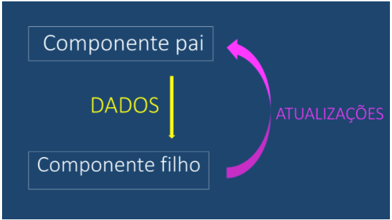
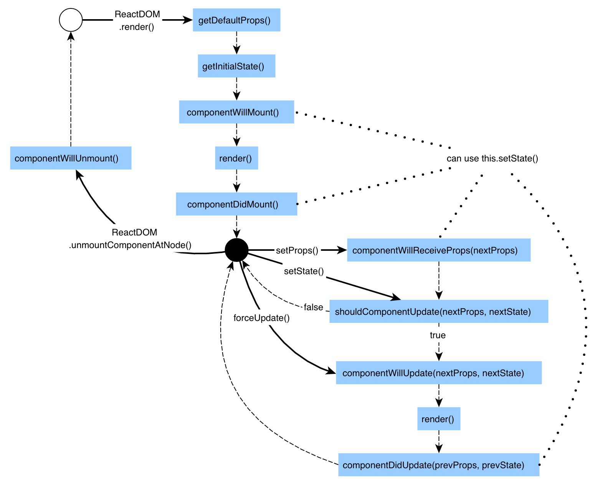
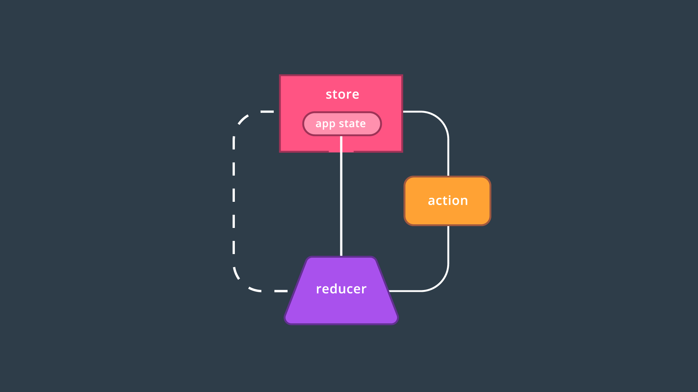

# Two Way Data Binding #

A atualização do dados no react ocorre sempre de pai para filho: 




Sendo assim o responsável sempre pela atualização dos dados será o componente pai ex:

```html
<FlightPlanner>
  <DatePicker />
  <DestinationPicker />
</FlightPlanner>
```

Seguindo o exemplo acima o componente responsável pela atualização dos dados será sempre o:
* FlightPlanner

```html
<FlightPlanner>

  <LocationPicker>
    <OriginPicker />
    <DestinationPicker />
  </LocationPicker>

  <DatePicker />

</FlightPlanner>
```

Já no exemplo acima existem dois componentes responsáveis pela atualização dos dados: 

* FlightPlanner
* LocationPicker


# Como funciona os templates no React #

Para escrever o "html" o react utiliza o React DOM, seria objetos Javascript que irá escrever no dom o html 

ex: 

```javascript
import { React } from 'react'
import { ReactDOM } from 'react-dom'

const element = React.createElement('div', { className: 'welcome-message' }, 'Hello World');


ReactDom.render(
  element,
  document.getElementById('root')
)
```

no final o código acima teremos: 

```html
<div class="welcome-message">Hello World</div>
```

Podemos aninhar elementos também ex: 

```javascript
import { React } from 'react'
import { ReactDOM } from 'react-dom'

const people = [
  {name: 'Michel'},
  {name: 'Ryan'},
  {name: 'Tyler'}
];

const element = React.createElement('ol', null,
  people.map((person, index) => (
    React.createElement('li', {key: index}, person.name)
  ))
);


ReactDom.render(
  element,
  document.getElementById('root')
)
```

## Resultado: ##

```html
  <ol>
    <li id="0">Michel</li>
    <li id="1">Ryan</li>
    <li id="2">Tyler</li>
  </ol>
```

Porem para ajudar nossa vida foi criado o JSX

# JSX #

Esse cara nada mais é que a possibilidade de você escrever o seu template como se fosse um html ex:


refazendo o ultimo exemplo só que agora utilizando jsx: 

```javascript
import { React } from 'react'
import { ReactDOM } from 'react-dom'

const people = [
  {name: 'Michel'},
  {name: 'Ryan'},
  {name: 'Tyler'}
];

const element = <ol>
  {people.map(person => (
    <li key='{person.name}'>{person.name}</li>
  ))}
  <li></li>
</ol>;


ReactDom.render(
  element,
  document.getElementById('root')
)
```

***Muito mais simples né***


# Criando components #

Para criar um componente você pode cria-lo usando classes ou componente funcional sem estado.

Ex: Classe

```javascript
import React, {Component} from 'react';


class ListContacts extends Component {
    render() {
        console.log('props',this.props);
        return (
            <ol className='contact-list'>
                {this.props.contacts.map((contact) => (
                    <li key={contact.id} className='contact-list-item'>
                        <div className='contact-avatar' style={{
                            backgroundImage: `url(${contact.avatarURL})`
                        }}>
                        </div>
                        <div className='contact-details'>
                            <p>{contact.name}</p>
                            <p>{contact.email}</p>
                        </div>
                        <button className='contact-remove'>
                            remove
                        </button>
                    </li>
                ))}
            </ol>
        )
    }
}

export default ListContacts;
```

Ex: Componente funcional sem estado

```javascript
import React, {Component} from 'react';


function ListContactsSemEstado(props) {
    return (
        <ol className='contact-list'>
            {props.contacts.map((contact) => (
                <li key={contact.id} className='contact-list-item'>
                    <div className='contact-avatar' style={{
                        backgroundImage: `url(${contact.avatarURL})`
                    }}>
                    </div>
                    <div className='contact-details'>
                        <p>{contact.name}</p>
                        <p>{contact.email}</p>
                    </div>
                    <button className='contact-remove'>
                        remove
                    </button>
                </li>
            ))}
        </ol>
    )
}

export default ListContactsSemEstado;
```

Ambos são utilizados da mesma forma: 

```javascript
import React, {Component} from "react";
import ListContacts from './ListContacts';
import ListContactsSemEstado from './ListContactsSemEstado';

const contacts = [
    {
        "id": "ryan",
        "name": "Ryan Florence",
        "email": "ryan@reacttraining.com",
        "avatarURL": "http://localhost:5001/ryan.jpg"
    },
    {
        "id": "michael",
        "name": "Michael Jackson",
        "email": "michael@reacttraining.com",
        "avatarURL": "http://localhost:5001/michael.jpg"
    },
    {
        "id": "tyler",
        "name": "Tyler McGinnis",
        "email": "tyler@reacttraining.com",
        "avatarURL": "http://localhost:5001/tyler.jpg"
    }
];


class App extends Component {

    render() {
        return (
            <div>
                <ListContacts contacts={contacts}/>
                <ListContactsSemEstado contacts={contacts}/>


            </div>
        )
    }

}

export default App;
```


Porem quando você só tem o método render na sua classe, vale muito a pena utilizar componente funcional sem estado.


# Guardando Estado #

Quando queremos armazenar alguma propriedade e queremos que o react controle seu estado utilizamos da seguinte forma: 

```javascript
import React, {Component} from "react";
import ListContacts from './ListContacts';
import ListContactsSemEstado from './ListContactsSemEstado';
import ListContactsSemEstadoEs6 from "./ListContactsSemEstadoEs6";


class App extends Component {

    state = {
        contacts: [
            {
                "id": "ryan",
                "name": "Ryan Florence",
                "email": "ryan@reacttraining.com",
                "avatarURL": "http://localhost:5001/ryan.jpg"
            },
            {
                "id": "michael",
                "name": "Michael Jackson",
                "email": "michael@reacttraining.com",
                "avatarURL": "http://localhost:5001/michael.jpg"
            },
            {
                "id": "tyler",
                "name": "Tyler McGinnis",
                "email": "tyler@reacttraining.com",
                "avatarURL": "http://localhost:5001/tyler.jpg"
            }
        ]
    };

    removeContact = (contact) => {
        this.setState((state) => ({
            contacts: state.contacts.filter((c) => c.id !== contact.id)
        }))
    };


    render() {
        return (
            <div>
                <ListContacts onDeleteContact={this.removeContact} contacts={this.state.contacts}/>
                <ListContactsSemEstado contacts={this.state.contacts}/>
                <ListContactsSemEstadoEs6 contacts={this.state.contacts}/>


            </div>
        )
    }

}

export default App;

```

Criamos uma variavel state dentro da classe do componente e manipulamos ela com o comando this.setState.

this.setState pode ser chamado de duas formas: 

1. Alterando somente uma propriedade dentro do estado ex:

```
state = { 
  nome: 'Rodrigo',
  telefone: ''
}

// porem quero alterar somente o telefone: 

this.setState({
  telefone: '98075-2222'
})
``` 

2. Podemos chamar uma função que iré retornar o estado anterior e assim podemos altera-lo : 

```javascript
 this.setState((state) => ({
      contacts: state.contacts.filter((c) => c.id !== contact.id)
  }))
```


# Tipando os props passados para o componente #

Verificação dos tipos de props de um componente com PropTypes
À medida que implementamos recursos adicionais em nossa aplicação, rapidamente nos vemos depurando os componentes com mais frequência. Por exemplo, e se os props que passamos para nossos componentes acabam sendo de tipos de dados não intencionais (por exemplo, um objeto em vez de um array)? O PropTypes é um pacote que nos permite definir os tipos de dados que queremos ter e nos avisar, durante o desenvolvimento, se o prop que foi passado para o componente coincide ou não com o esperado.


```
npm install --save prop-types
```


## Ex utilização em classes: 

```javascript
class ListContacts extends Component {

    static propTypes = {
        contacts: PropTypes.array.isRequired,
        onDeleteContact: PropTypes.func.isRequired
    };

}
```


# Lifecycle Events #

> <span style="color:red;font-size:2em">render()</span> é para renderizar, apenas!
>Apesar de já termos mencionado no vídeo, eu gostaria de enfatizar que dados/informações não devem ser recuperados no método render! O método render() deve ser utilizado apenas para renderizar seu próprio componente; este método não deve fazer nenhuma requisição HTTP, recuperar dados que são utilizados para mostrar seu conteúdo ou alterar o DOM. Além disso, o método render() também não deve chamar nenhuma função que execute qualquer uma dessas ações citadas.
>Então, se o render() só é usado para exibir conteúdo, nós colocamos o código que deve lidar com requisições Ajax, por exemplo, no que o React chama de eventos de ciclo de vida (lifecycle events).


1. <span style="color:red">**componentWillMount()**</span>
  
    invocado imediatamente antes do componente ser inserido no DOM

2. <span style="color:red">**componentDidMount()**</span>

    invocado imediatamente depois do componente ser inserido no DOM

3. <span style="color:red">**componentWillUnmount()**</span>

    invocado imediatamente antes do componente ser removido do DOM

4. <span style="color:red">**componentWillReceiveProps()**</span>

    invocado sempre que o componente está prestes a receber novas props


## Ciclo de vida (LifeCycle) ##

### Adicionando ao DOM ###

Estes eventos são chamados quando um componente está sendo adicionado ao DOM:

* constructor()
* componentWillMount()
* render()
* componentDidMount()


### Renderizando novamente ### 

Estes eventos são chamados quando um componente é atualizado (renderizado novamente) no DOM:

* componentWillReceiveProps()
* shouldComponentUpdate()
* componentWillUpdate()
* render()
* componentDidUpdate()


### Removendo do DOM ### 

Este evento é chamado quando um componente está sendo removido do DOM:

* componentWillUnmount()


É mais fácil identificar quando cada um ocorre ao ver o gráfico a seguir:



# React-Router #

Api para fazer as rotas de uma aplicação SPA

Instalando: 

```
npm install --save react-router-dom
```


**BrowserRouter**

Responsável por fazr a navegação e apresentar a pagina correta.


**Link**

Um dos componentes responsável por fazer a navegação ex:

```javascript
<Link
    to='/create'
    className='add-contact'>Add Contact</Link>
```

Gerando um link mais complexo (Passando parametros para a rota): 

```javascript
<Link to={{
        pathname: '/courses',
        search: '?sort=name',
        hash: '#the-hash',
        state: { fromDashboard: true }
    }}>
  Courses
</Link>
``` 


**Route**

Componente responsável por fazer a renderização da navegação

ex:

```javascript

  <Route exact path='/' render={() => (
          <ListContacts
            onDeleteContact={this.removeContact}
            contacts={this.state.contacts}
          />
        )} />
        
    <Route path='/create' component={CreateContacts} />

```

***exact** o Router considera o path que contenha a string colocando o exact o router só irá reenderizar se atender o path exato


# Formulários #

Para serializar um formulário utilizaremos a api: 

form-serialize - https://www.npmjs.com/package/form-serialize

Instalando:
```
npm install --save form-serialize
```

# Testes

https://github.com/facebookincubator/create-react-app/blob/master/packages/react-scripts/template/README.md#running-tests

utilize o enzyme para facilitar nossos testes

Comando para iniciar com um setup: 

```
// no package.json adicionar "test": "react-scripts test --env=jsdom ",

//o  comando: --setupFiles='./src/__setups__/setupTest.js'",

// setupTest.js

import { configure } from 'enzyme';
import Adapter from 'enzyme-adapter-react-16';

configure({ adapter: new Adapter()});

const localStorageMock = {
    getItem: jest.fn(),
    setItem: jest.fn(),
    clear: jest.fn()
};
global.localStorage = localStorageMock

global.requestAnimationFrame = global.window.requestAnimationFrame || function(fn) {
    return setTimeout(fn, 0)
}

```

```javascript
npm install --save enzyme react-test-renderer

npm i --save-dev enzyme enzyme-adapter-react-16

npm install --save-dev enzyme-to-json
```

https://www.npmjs.com/package/enzyme-to-json

Alterar o package.json para configurar o jest: 

# Utils #

Extenssão do Chrome: 

1. React Developer Tools

2. Pacote para scape-string https://www.npmjs.com/package/escape-string-regexp

3. Pacote para ordenar https://www.npmjs.com/package/sort-by

4. recompose

5. react-google-maps

5. redux-logger https://www.npmjs.com/package/redux-logger
    
    Middleware para fazer log de uma transação redux

6. redux-thunk https://github.com/gaearon/redux-thunk

    Middleware para trabalhar com assincronidade em uma aplicação com Redux

## O pacote npm redux-logger ##

O pacote redux-logger já vem configurado com opções padrão, mas, fique à vontade para adicionar outras personalizações, se necessário!


# Redux #


Redux é uma biblioteca de JavaScript usada para gerenciar o estado do front-end de um aplicativo. Ele não é obrigatório em aplicativos de React, porém, conforme web apps se tornam mais complexos, podem surgir bugs devido ao gerenciamento incorreto de estados. O estado global dos aplicativos Redux é mantido em uma single source of truth: a Redux Store. Como as alterações de estado são bem controladas, isso torna o Redux bastante previsível. Na verdade, um das principais motivos pelos quais os desenvolvedores adoram Redux é sua previsibilidade. Vamos ver por quê!



Este é o gráfico que acabamos de ver. Como você pode ver, existem três partes principais no Redux:

actions  
reducers  
store  
A maior parte dos dados ou estado do aplicativo vive na store. Os dados da store são preenchidos por reducers (é possível ter mais de um reducer, mas estamos apenas mostrando um na imagem). Uma action é “despachada” pela store, e é o que é usada pelos reducers para determinar quais dados eles devem produzir. Para ser mais claro, pode (e vai!) haver mais de uma única action em um aplicativo Redux.  


## Actions ##

>💡 Recomendações para actions 💡  
>Algumas coisas para se ter em mente conforme você constrói objetos de action:  
>  
>Prefira constantes a strings como os valores de propriedades type. Ambos funcionam -- mas quando usamos constantes, o console lançará um erro em vez de falhar silenciosamente, caso haja algum   
>erro de grafia (por exemplo: LAOD_PROFILE em vez de LOAD_PROFILE).  
>Mantenha os dados transmitidos do menor tamanho possível. Faça com que seus recursos enviem apenas os dados necessários!  


```javascript

const initialCalendarState = {
  sunday: {
    breakfast: null,
    lunch: null,
    dinner: null
  },
  monday: {
    breakfast: null,
    lunch: null,
    dinner: null
  },
  tuesday: {
    breakfast: null,
    lunch: null,
    dinner: null
  },
  wednesday: {
    breakfast: null,
    lunch: null,
    dinner: null
  },
  thursday: {
    breakfast: null,
    lunch: null,
    dinner: null
  },
  friday: {
    breakfast: null,
    lunch: null,
    dinner: null
  },
  saturday: {
    breakfast: null,
    lunch: null,
    dinner: null
  }
};

function c(){
  let dia = 'sunday';
  return {
      // O ... adiciona o objeto anterior a esse novo objeto
    ...initialCalendarState,
    // os [] faz com que o dia especifico 'sunday' seja alterado dentro do objeto
    [dia]: {
     // adicionando todo o dia
      ...initialCalendarState[dia],
      // alterando somente 1 propriedade
      breakfast: 'rodrigo'
    }
  }
}

console.log(c());

```


# Store #

Para criar uma store, você passa uma função reducer como o primeiro argumento para o método createStore() do Redux. O que é retornado pelo createStore() é a próprio store. Essa store tem três propriedades:

* getState()  
* dispatch()  
* subscribe()  


## getState()  ##

store.getState() não recebe nenhum argumento e retorna o estado atual da store.

## dispatch() ## 
store.dispatch(action) recebe um objeto da action e chama a função reducer, passando o estado atual e a action que foi despachada para ela. Por exemplo:


```javascript
// store.js

import { createStore } from 'redux';
import reducer from '../reducers/reducer';

let store = createStore(reducer);

const receiveComment = comment => ({
  type: 'RECEIVE_COMMENT',
  comment
});

export default store;

```

```javascript
store.getState(); // []
store.dispatch(receiveComment('Redux is great!'));
store.getState(); // ['Redux is great!']
```

## subscribe() ##

store.subscribe(cb) recebe uma função listener de callback que será invocada sempre que o estado da store for alterado.


## 💡 O atributo ref 💡 ##

>O código no vídeo anterior usou o atributo ref. O atributo ref é um atributo especial fornecido pelo React, que permite que você acesse o DOM. Para mais informações sobre o ref e quando/como voc    
>deveria usá-lo, dê uma olhada na documentação de Ref e no DOM.

# react-redux #

A maior vantagem do react-redux é percebida no despacho de actions e no acesso à store do Redux a partir dos seus componentes React. Isso tudo é possível graças ao componente Provider do react-redux, e ao método connect().

O connect() permite que você especifique quais componentes devem receber quais dados da store, e o Provider faz com que connect() funcione corretamente. Vamos nos aprofundar nesses dois elementos.


Para configura-lo basta adicionar um component Provider ex:

`import { Provider } from 'react-redux';`

Adicionar no ReactDOM.render o componente Provider ex código completo: 


```javascript
import React from 'react';
import ReactDOM from 'react-dom';
import './index.css';
import App from './components/App';
import registerServiceWorker from './registerServiceWorker';
import { createStore } from 'redux';
import reducer from './reducers';
import { Provider } from 'react-redux';

const store = createStore(
  reducer,
  window.__REDUX_DEVTOOLS_EXTENSION__ && window.__REDUX_DEVTOOLS_EXTENSION__()
);


ReactDOM.render(
  <Provider store={store}>
    <App store={store} />
  </Provider>
  , document.getElementById('root'));
registerServiceWorker();


```
# Reduce

## Quiz

```javascript
/* Popular Ice Cream Totals Quiz
 *
 * Using the data array and .reduce():
 *   - Return an object where each property is the name of an ice cream flavor
 *     and each value is an integer that's the total count of that flavor
 *   - Store the returned data in a new iceCreamTotals variable
 *
 * Notes:
 *   - Do not delete the data variable
 *   - Do not alter any of the data content
 */

 const data = [
     { name: 'Tyler', favoriteIceCreams: ['Strawberry', 'Vanilla', 'Chocolate', 'Cookies & Cream'] },
     { name: 'Richard', favoriteIceCreams: ['Cookies & Cream', 'Mint Chocolate Chip', 'Chocolate', 'Vanilla'] },
     { name: 'Amanda', favoriteIceCreams: ['Chocolate', 'Rocky Road', 'Pistachio', 'Banana'] },
     { name: 'Andrew', favoriteIceCreams: ['Vanilla', 'Chocolate', 'Mint Chocolate Chip'] },
     { name: 'David', favoriteIceCreams: ['Vanilla', 'French Vanilla', 'Vanilla Bean', 'Strawberry'] },
     { name: 'Karl', favoriteIceCreams: ['Strawberry', 'Chocolate', 'Mint Chocolate Chip'] }
 ];


let iceCreamTotals = data.reduce((accumulate, data) => {
    
    data.favoriteIceCreams.forEach(f => {
        
        if(accumulate[f]){
            accumulate[f]++;
        }else{
            accumulate[f] = 1;
        }
        
      });
    
    return accumulate
    }, {});

console.log(iceCreamTotals);
```


# Usando o connect # 

connect() é uma função que permite que um componente obtenha dados e despache actions a partir de uma store do Redux. Sua assinatura é interessante. Usando todos os argumentos, ela fica assim:

`connect(mapStateToProps, mapDispatchToProps)(MyComponent)`

Para adiantar um pouco a explicação, MyComponent é o componente que você quer que receba dados da store, despache actions nela, ou ambos. mapStateToProps() é uma função que recebe a store atual e as props atuais, e o que ela retorna será disponível para MyComponent como propriedades. mapDispatchToProps() permite que você envolva action creators dentro do despacho. Vamos olhar para cada uma delas mais de perto!

## mapStateToProps() ##

mapStateToProps() permite que você especifique que dados do store você quer que sejam passados para seus componente React. Ele pega do state de store um argumento opcional ownprops, e retorna um objeto. Veja sua assinatura completa:

`mapStateToProps(state, [ownProps])`


# click dentro de click

Quando utilizamos um onClick dentro de outro onClick o html executa uma propagação invoca o primero onclick e depois o outros automaticamente. 

Caso queira alterar esse comportamento basta utilizar 

```
onClick={(event) => { 
    event.stopPropagation();
  }
})
```
